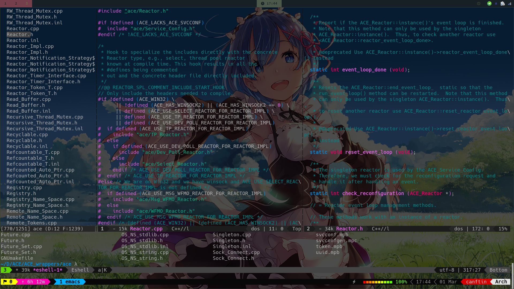

# MyRC
my archlinux setting resouce files, the `wsl` fold is about windows subsystem linux environment setting.



tmux config from [gpakosz/.tmux](https://github.com/gpakosz/.tmux)

i3wm config from [CanftIn/i3wm-themer](https://github.com/CanftIn/i3wm-themer)

urxvt font(Hack Nerd Font) from [nerd-fonts](https://github.com/ryanoasis/nerd-fonts)

touchpad setting [libinput-gestures.conf](.config/libinput-gestures.conf)
need `libinput-gestures` installed to support guestures
```
$ sudo gpasswd -a $USER input  # add user to input user group
$ vim $HOME/.config/libinput-gestures.conf # copy /etc/libinput-gestures.conf
$ libinput-gestures-setup start
```
enable the touchpad:
```
$ xinput list
$ xinput list-props "SynPS/2 Synaptics TouchPad" 
$ xinput set-prop "SynPS/2 Synaptics TouchPad"  "libinput Tapping Enabled" 1
```

**how to use:**
```bash
git clone https://github.com/CanftIn/MyRC.git
cd MyRC
cp -r . ~
```
